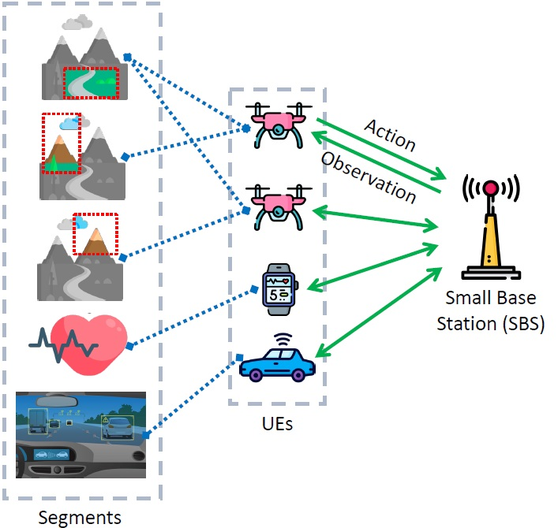
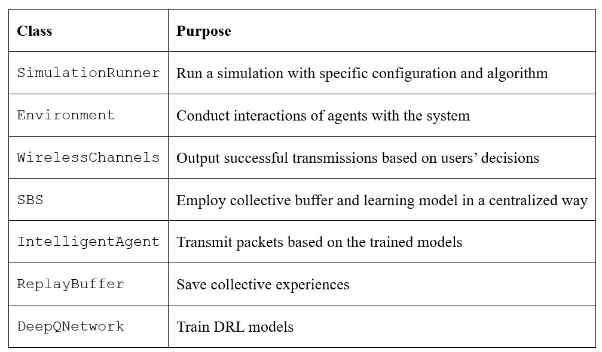

# SAMA-D3QL

This is the implementation of the WCNC 2024 paper <a href="https://arxiv.org/html/2401.06308v1">A Semantic-Aware Multiple Access Scheme for Distributed, Dynamic 6G-Based Applications</a>

Authored by Hamidreza Mazandarani, Masoud Shokrnezhad, and Tarik Taleb.

Abstract:

The emergence of the semantic-aware paradigm presents opportunities for innovative services, especially in the context of 6G-based applications. Although significant progress has been made in semantic extraction techniques, the incorporation of semantic information into resource allocation decision-making is still in its early stages, lacking consideration of the requirements and characteristics of future systems. In response, this paper introduces a novel formulation for the problem of multiple access to the wireless spectrum. It aims to optimize the utilization-fairness trade-off, using the 𝛼-fairness metric, while accounting for user data correlation by introducing the concepts of self- and assisted throughputs. Initially, the problem is analyzed to identify its optimal solution. Subsequently, a Semantic-Aware Multi-Agent Double and Dueling Deep Q-Learning (SAMA-D3QL) technique is proposed. This method is grounded in Model-free Multi-Agent Deep Reinforcement Learning (MADRL), enabling the user equipment to autonomously make decisions regarding wireless spectrum access based solely on their local individual observations. The efficiency of the proposed technique is evaluated through two scenarios: single-channel and multi-channel. The findings illustrate that, across a spectrum of 𝛼 values, association matrices, and channels, SAMA-D3QL consistently outperforms alternative approaches. This establishes it as a promising candidate for facilitating the realization of future federated, dynamically evolving applications.

</img>

# Usage

Please go ahead and execute the main.py script. Please reach out to hr.mazandarani@ieee.org with any inquiries.

List of Python classes:

</img>

# Publication
If you find this repository useful, please cite our paper:

```
@article{mazandarani2024semantic,
  title={A Semantic-Aware Multiple Access Scheme for Distributed, Dynamic 6G-Based Applications},
  author={Mazandarani, Hamidreza and Shokrnezhad, Masoud and Taleb, Tarik},
  journal={arXiv preprint arXiv:2401.06308},
  year={2024}
}
```
